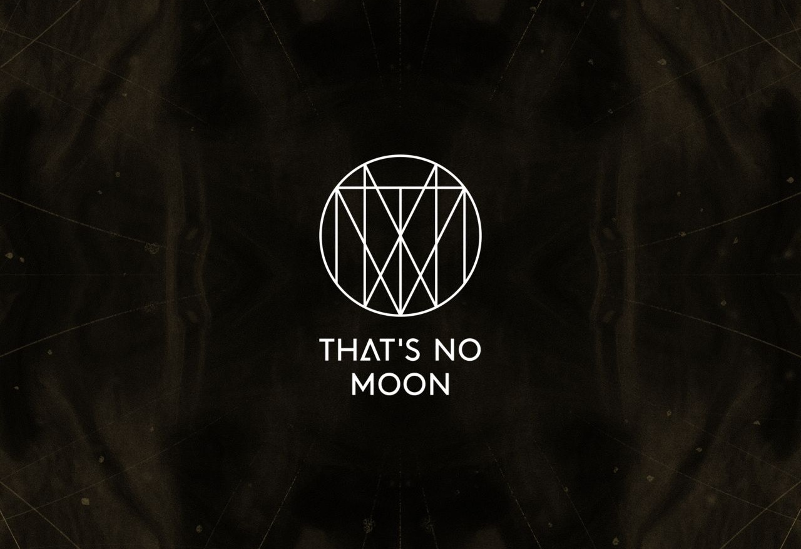
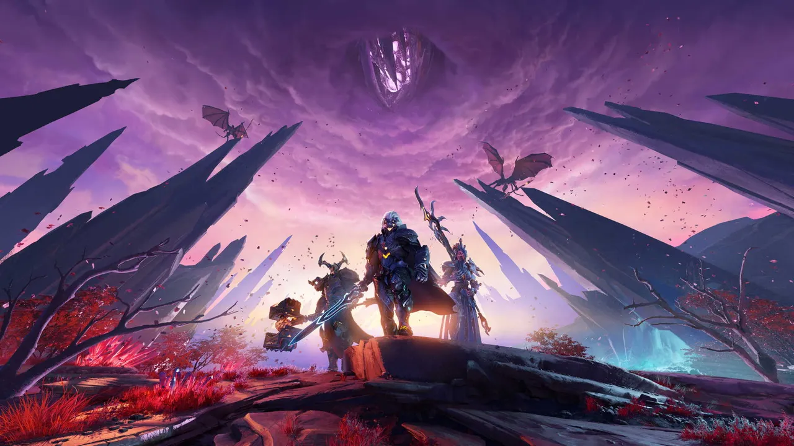
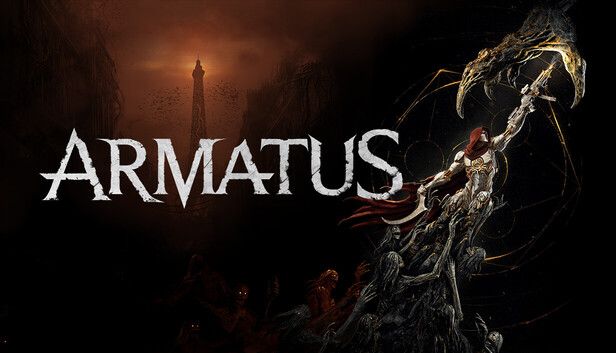
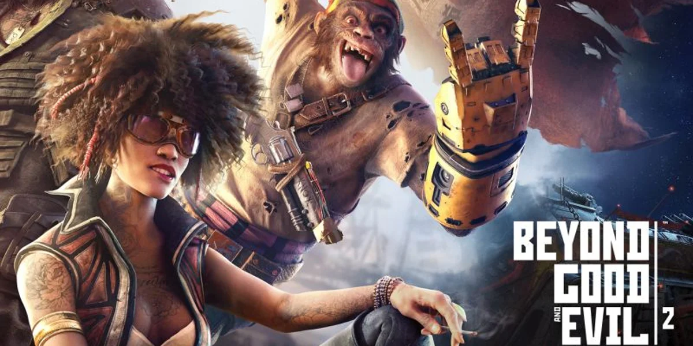
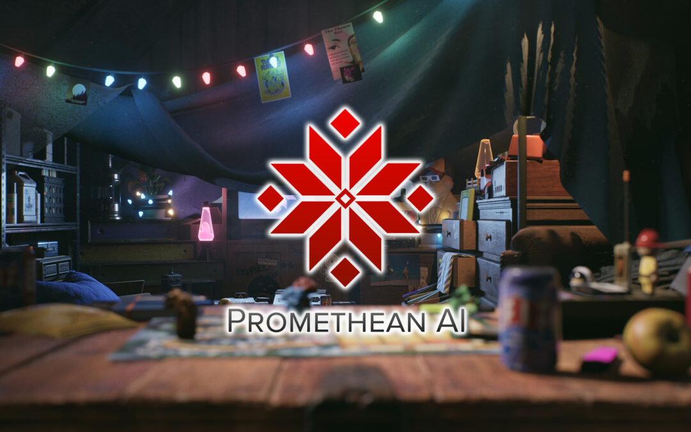
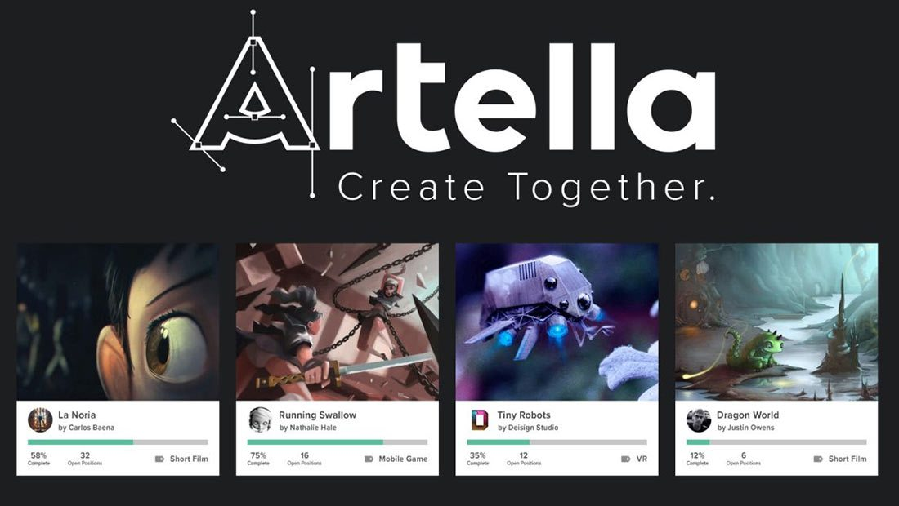
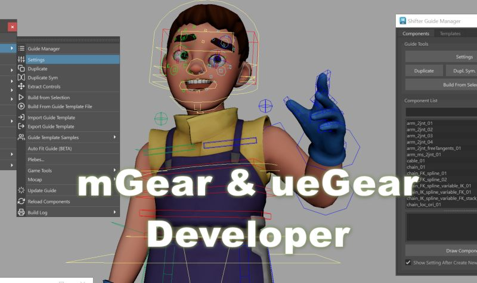

<!-- 
 -->
<p align="center">
  
</p>

<p align="center">
  <a href="https://www.tomipoveda.com"></a>
  <a href="https://github.com/tpoveda"></a>
  <a href="https://github.com/tpoveda"></a>
  <a href="https://www.linkedin.com/in/tpoveda/"></a>
  <a href="https://twitter.com/tomipoveda"></a>
  <a href="https://vimeo.com/tpoveda"></a>
  <a href="https://open.spotify.com/"></a>
</p>

<p align="center">
  
</p>

```python
#!/usr/bin/env python3
# -*- coding: utf-8 -*-

from dataclasses import dataclass


@dataclass(frozen=True)
class SoftwareDeveloperPipelineTD:
    name: str = "Tomás Poveda"
    roles: tuple[str, ...] = ("Software Developer", "Pipeline TD")
    languages: tuple[str, ...] = ("es_ES", "en_US")
    programming_languages: tuple[str, ...] = (
        "Python", "C++", "C#", "JavaScript/TypeScript",
    )

    dcc_focus: tuple[str, ...] = (
        "Maya", "Unreal Engine", "Houdini", "USD", "Qt/PySide",
    )
    services_stack: tuple[str, ...] = (
        "FastAPI", "Node.js", "TypeScript", "React",
        "Postgres/Redis", "Docker", "CI/CD",
    )
    interests: tuple[str, ...] = (
        "DCC-agnostic Python tooling",
        "Asset-management pipelines",
        "Unreal plugin development",
        "Cinematic & animation pipelines",
        "Service-oriented backends • observability • testing",
    )

    def say_hi(self) -> str:
        return (
            "Thanks for dropping by — I build artist-friendly tools, robust "
            "pipelines, and reliable services so teams can move faster."
        )


me = SoftwareDeveloperPipelineTD()
print(me.say_hi())
```

<p align="center">
  
</p>

<h3>
  
  Tech I use and enjoy
</h3>

<p align="center">
  
</p>

<p align="center">
  
  
  
  
</p>

<p align="center">
  
</p>

<h3>
  
  What I'm into lately
</h3>

- DCC‑agnostic Python tooling and scalable asset‑management pipelines.
- Unreal plugin development; cinematic and animation pipelines.
- Service‑oriented backends with FastAPI, robust CI/CD, observability, and testing.

<p align="center">
  
</p>

<h3>
  
  Career highlights
</h3>

<div align="center">
  <table border="0" style="border-collapse:collapse;border-spacing:0;border:none;outline:none;border-radius:12px;overflow:hidden;">
    <tr>
      <td width="60%" valign="top" style="border:none;">
        <b>That's No Moon</b> — Senior Animation TD<br/>
        <sub>Feb 2023 – Present · Remote (Los Angeles)</sub>
        <ul>
          <li>Animation/rigging tooling and pipeline automation across DCCs and Unreal Engine (Control Rig).</li>
          <li>Driving scalable, artist‑friendly workflows and standards for next‑gen production.</li>
        </ul>
      </td>
      <td width="40%" valign="top" align="center" style="border:none;">
        
      </td>
    </tr>
    <tr>
      <td width="60%" valign="top" style="border:none;">
        <b>Counterplay Games</b> — Senior Technical Animator<br/>
        <sub>Apr 2021 – Dec 2022 · Freelance</sub>
        <ul>
          <li>Built a modular, DCC‑agnostic, multi‑project pipeline from the ground up.</li>
          <li>Integrated a new modular rigging builder; streamlined rigging/animation workflows.</li>
          <li>Unreal: Control Rig, custom importers/exporters, physics assets; custom rig components + skinning.</li>
        </ul>
      </td>
      <td width="40%" valign="top" align="center" style="border:none;">
        
        
      </td>
    </tr>
    <tr>
      <td width="60%" valign="top" style="border:none;">
        <b>Ubisoft</b> — Technical Artist<br/>
        <sub>Oct 2017 – Sep 2019 · Barcelona (On‑site)</sub>
        <ul>
          <li>Beyond Good & Evil 2: character pipeline tooling; cross‑DCC data I/O (MaxScript/MEL/Python).</li>
          <li>Assassin’s Creed III Remastered: outfit rigging, in‑engine cloth; MaxScript/C# tools.</li>
        </ul>
      </td>
      <td width="40%" valign="top" align="center" style="border:none;">
        
        
      </td>
    </tr>
    <tr>
      <td width="60%" valign="top" style="border:none;">
        <b>Promethean AI</b> — Senior Technical Artist<br/>
        <sub>May 2020 – Apr 2021 · Freelance</sub>
        <ul>
          <li>Contributed to first public release; Maya and 3ds Max plugin integrations.</li>
          <li>Improved CLI tooling; custom installer & deployment (PyInstaller + Cython).</li>
        </ul>
      </td>
      <td width="40%" valign="top" align="center" style="border:none;">
        
      </td>
    </tr>
    <tr>
      <td width="60%" valign="top" style="border:none;">
        <b>Artella</b> — Software Developer<br/>
        <sub>May 2020 – Jul 2021 · Freelance</sub>
        <ul>
          <li>Re‑implemented Python Artella Client and a DCC‑agnostic plugin framework.</li>
          <li>Shipped Artella Maya plugin and custom plugins installer.</li>
        </ul>
      </td>
      <td width="40%" valign="top" align="center" style="border:none;">
        
        <br/>
        <a href="https://github.com/artella" title="Artella on GitHub" aria-label="Artella on GitHub">
          
        </a>
      </td>
    </tr>
    <tr>
      <td width="60%" valign="top" style="border:none;">
        <b>mcsGear</b> — ueGear Developer<br/>
        <sub>Dec 2022 – Feb 2023 · Freelance</sub>
        <ul>
          <li>ueGear plugin development for Maya and Unreal Engine.</li>
        </ul>
      </td>
      <td width="40%" valign="top" align="center" style="border:none;">
        
        <br/>
        <a href="https://github.com/mgear-dev/ueGear" title="ueGear repository" aria-label="ueGear repository">
          
        </a>
      </td>
  </tr>
  </table>
</div>

<p align="center">
  
</p>

<h3>
  
  Featured metrics
</h3>

<p align="center">
  
</p>

<p align="center">
  
</p>

<p align="center">
  
</p>

<p align="center">
  
</p>

<p align="center">
  
</p>

<p align="center">
  
</p>

<p align="center">
  <a href="https://www.linkedin.com/in/tpoveda/" aria-label="LinkedIn" title="LinkedIn" style="margin:0 10px;">
    
  </a>
  <a href="https://www.tomipoveda.com" aria-label="Website/Portfolio" title="Website/Portfolio" style="margin:0 10px;">
    
  </a>
  <a href="https://twitter.com/tomipoveda" aria-label="X (Twitter)" title="X (Twitter)" style="margin:0 10px;">
    
  </a>
  <a href="https://vimeo.com/tpoveda" aria-label="Vimeo" title="Vimeo" style="margin:0 10px;">
    
  </a>
</p>

<p align="center" style="margin-top:24px;">
  
  
</p>
